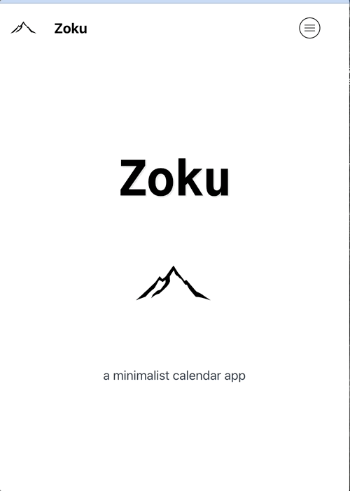

# Zoku Calendar App

Zoku is a full-stack time tracking and calendar management application built with Next.js, Express, and PostgreSQL. It's MVP version is deployed on Railway (backend) and currently the frontend runs locally.

Zoku is a Japanese term that hints towards continuity or continuation. I wanted to build a calendar app that gives the user a sense of continuity and connection between the different pieces of their schedule. 

### Frontend App Running Locally

The MVP is a web application with responsive design. Here are some visuals.




### Deployment

I've split the front and the backend into two different repositories.

The [backend](https://github.com/rachel-labri-tipton/zoku-calendar-app-backend.git) is deployed with Railway. 

All API endpoints start here: `https://zoku-api.up.railway.app/`. 

The [frontend](https://github.com/rachel-labri-tipton/zoku-next-frontend-app.git), in the future, will be deployed either using Netlify or Vercel. 

For a demo, you can use the `Demo Login` button and these user credentials: 

`demo.user@example.com
Password123!`

## Origin Story

Every project has a story. Here's some more of the Zoku app's story. 

As part of Women Coding Community's 2025 Summer/Fall mentee cohort, I decided to use my time (3 hours a month) with my mentor  developing a side project that was not yet another tutorial project. 

As someone who loves to do lists and time management in both her personal and professional life, I wanted to create an application that reflects my personal aesthetics and my personal approach to time tracking. The MVP does not fully capture all the nuances, but it's a start. 

As a programmer, an artist, a writer, someone who has had a previous career as a translator, editor and university language instructor, in order to get my life's work done, I have learned to be intentional about my time. 

I also wanted to build a project that I can have as a side project for awhile and that I can add features to over time. For example, I've built the backend with Express but would be interested in converting that to NestJS in the future. 


## Features

For the MVP of this project I've worked on setting up the following features: 

- Calendar management with event scheduling
- Time tracking with customizable categories
- Todo list organization
- Goal setting and progress tracking
- Responsive design for all devices


## Inspiration

There are a lot of time and goal tracking apps out there. 

Here are a few I've researched: 

- [any.do](https://www.any.do/)
- [The Fabulous](https://www.thefabulous.co/)
- [Habitica](https://habitica.com/)
- [monday.com](https://monday.com/)
- [Oak-Meditation & Breathing](https://apps.apple.com/fr/app/oak-meditation-breathing/id1210209691)
- [Dawn - Minimal Calendar](https://apps.apple.com/us/app/dawn-minimal-calendar/id1509374383)

## Tech Stack

### Frontend
- Next.js 13+
- React
- TailwindCSS
- Material UI
- TypeScript
- date-fns


### Backend
- Express.js
- PostgreSQL
- Sequelize ORM
- JWT Authentication


## Database Diagram


## Initial wireframes


## Running application


## Architecture


### Architecture Components

#### Frontend Layer
- **Web Client**: Browser-based interface
- **Next.js Pages**: Server-side rendered pages
- **React Components**: Reusable UI components
- **State Management**: Client-side data handling
- **API Client**: Axios/Fetch service for API calls

#### Backend Layer
- **API Routes**: Express endpoints
- **Controllers**: Request handling logic
- **Services**: Business logic
- **Models**: Sequelize ORM models
- **Database**: PostgreSQL data storage

#### Authentication
- JWT-based authentication
- Secure token management
- Protected routes

#### External Services
- Railway for PostgreSQL hosting


## API Documentation

### Authentication
- POST /auth/register
- POST /auth/login
- POST /auth/logout

### Events
- GET /events
- POST /events
- PUT /events/:id
- DELETE /events/:id

The following routes have not yet been integrated into the other models of the application, but the plan is to assign a category to each activity and track activities via the `Time Logs` table. 

### Categories
- GET /categories
- POST /categories
- PUT /categories/:id
- DELETE /categories/:id

### Time Logs
- POST /time-logs/start
- POST /time-logs/:id/stop
- GET /time-logs/daily
- GET /time-logs/category/:id

# Running the Express Backend app

1. Clone the repository:
```bash
git clone https://github.com/rachel-labri-tipton/zoku-calendar-app-backend.git
```

2. Install dependencies:
```bash
cd zoku-calendar-backend
npm install
```

3. Set up environment variables:
```bash
cp .env.example .env
```

4. Start the development server:
```bash
npm run dev
```

5. Seeding the database
```bash
node seeders/seedData.js
```

# Running the Next.js Frontend

1. Clone the frontend repository (if separate):
   ```bash
   git clone https://github.com/yourusername/zoku-next-frontend-app.git
   cd zoku-next-frontend-app
   ```

2. Install dependencies:
   ```bash
   npm install
   # or
   yarn install
   ```

3. Create a `.env.local` file for environment variables (see `.env.example` if provided).

4. Start the development server:
   ```bash
   npm run dev
   # or
   yarn dev
   ```

5. Open [http://localhost:3000](http://localhost:3000) in your browser to view the app.

**Note:**  
- Make sure your backend server is running and the frontend `.env.local` is configured to point to the correct API URL.
- For production, use `npm run build` and `npm start`.
- Both NextJS and Express by default run on port localhost:3000. In most cases, NextJS will take port localhost:3001 when the express app is running. 


## License

This project is licensed under the MIT License - see the LICENSE file for details.