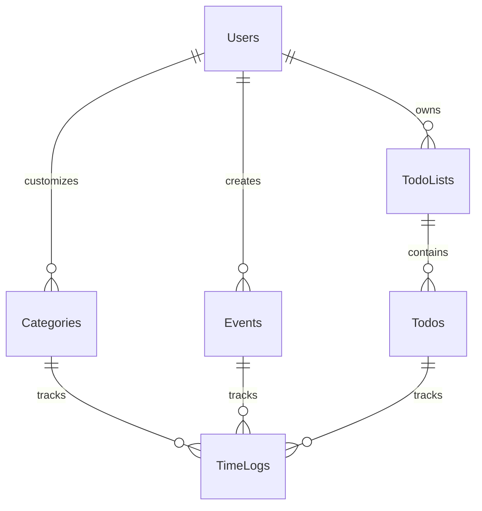

# Zoku Calendar App

A full-stack time tracking and calendar management application built with Next.js, Express, and PostgreSQL.

## Features

- Calendar management with event scheduling
- Time tracking with customizable categories
- Todo list organization
- Goal setting and progress tracking
- Responsive design for all devices

## Tech Stack

### Frontend
- Next.js 13+
- React
- TailwindCSS
- TypeScript

### Backend
- Express.js
- PostgreSQL
- Sequelize ORM
- JWT Authentication

## Database Schema



## Architecture


### Architecture Components

#### Frontend Layer
- **Web Client**: Browser-based interface
- **Next.js Pages**: Server-side rendered pages
- **React Components**: Reusable UI components
- **State Management**: Client-side data handling
- **API Client**: Axios/Fetch service for API calls

#### Backend Layer
- **API Routes**: Express endpoints
- **Controllers**: Request handling logic
- **Services**: Business logic
- **Models**: Sequelize ORM models
- **Database**: PostgreSQL data storage

#### Authentication
- JWT-based authentication
- Secure token management
- Protected routes

#### External Services
- Railway for PostgreSQL hosting


## Wireframes

### Desktop Views
- [ ] Calendar View
- [ ] Time Tracking Dashboard
- [ ] Category Management
- [ ] Todo Lists

### Mobile Views
- [ ] Mobile Calendar
- [ ] Time Entry
- [ ] Task Management

## API Documentation

### Authentication
- POST /auth/register
- POST /auth/login
- POST /auth/logout

### Events
- GET /events
- POST /events
- PUT /events/:id
- DELETE /events/:id

### Categories
- GET /categories
- POST /categories
- PUT /categories/:id
- DELETE /categories/:id

### Time Logs
- POST /time-logs/start
- POST /time-logs/:id/stop
- GET /time-logs/daily
- GET /time-logs/category/:id

## Local Development

1. Clone the repository:
```bash
git clone https://github.com/yourusername/zoku-calendar.git
```

2. Install dependencies:
```bash
cd zoku-calendar-backend
npm install
```

3. Set up environment variables:
```bash
cp .env.example .env
```

4. Start the development server:
```bash
npm run dev
```

## Testing

```bash
# Run unit tests
npm test

# Run integration tests
npm run test:integration
```

## Deployment

[Add deployment instructions]

## Contributing

[Add contribution guidelines]

## License

This project is licensed under the MIT License - see the LICENSE file for details.